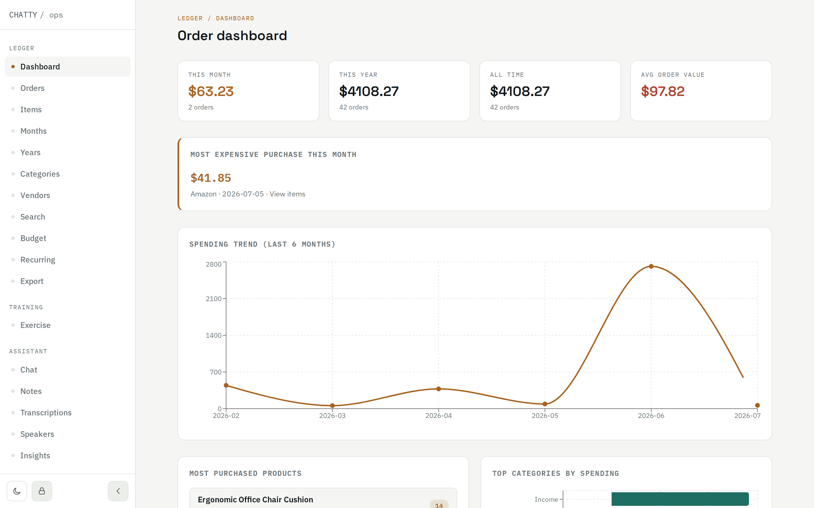
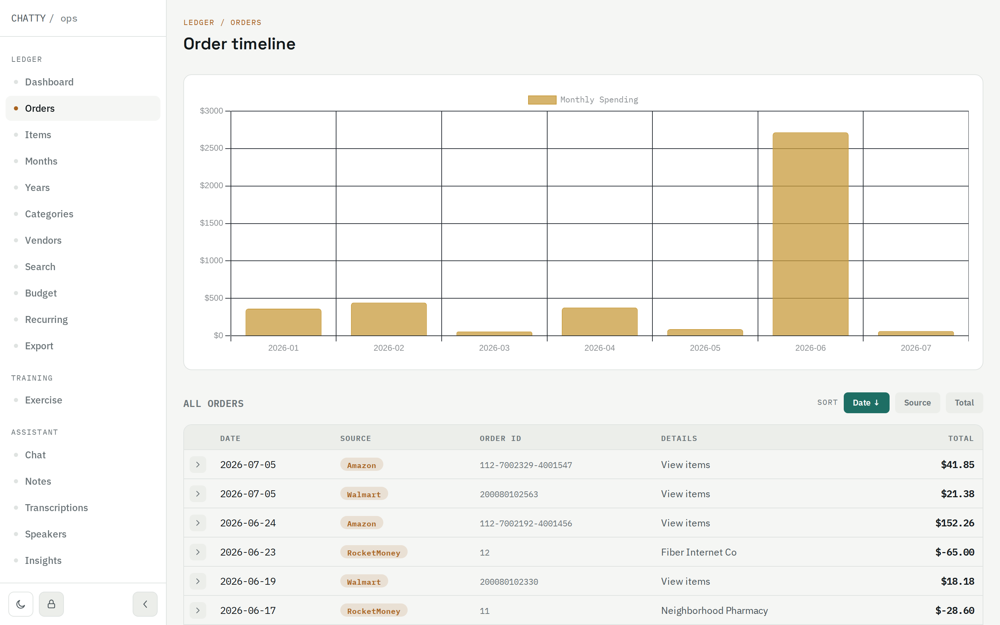
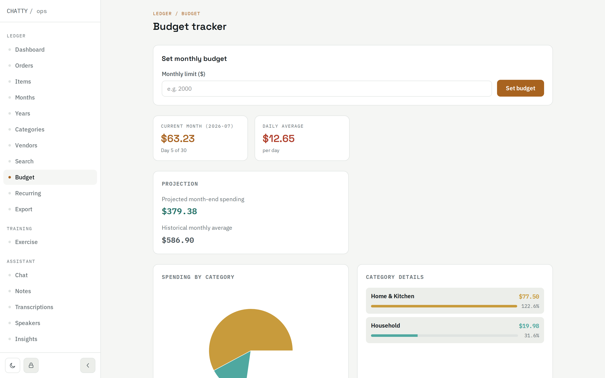
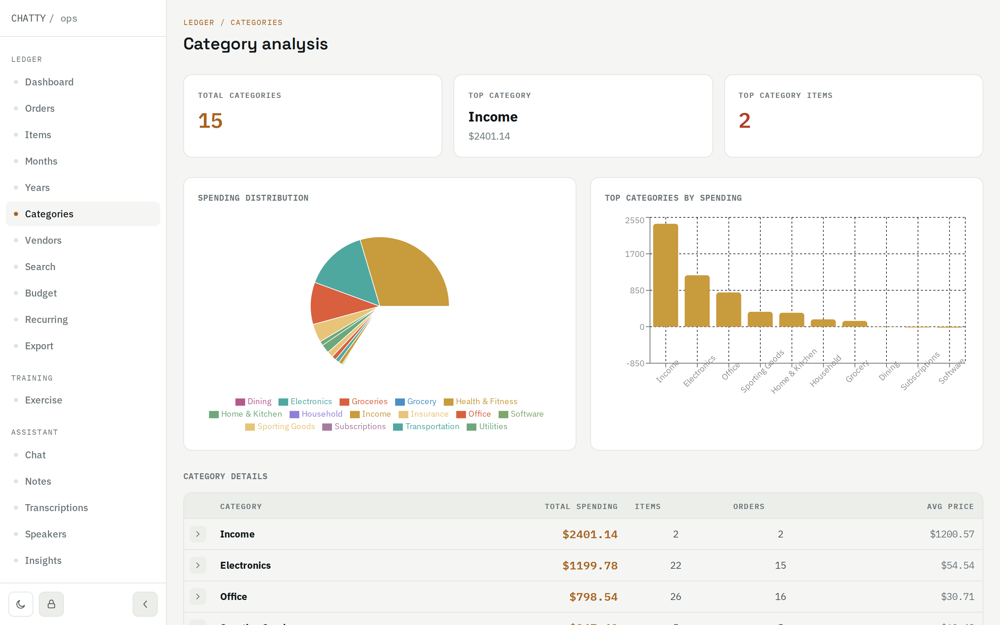
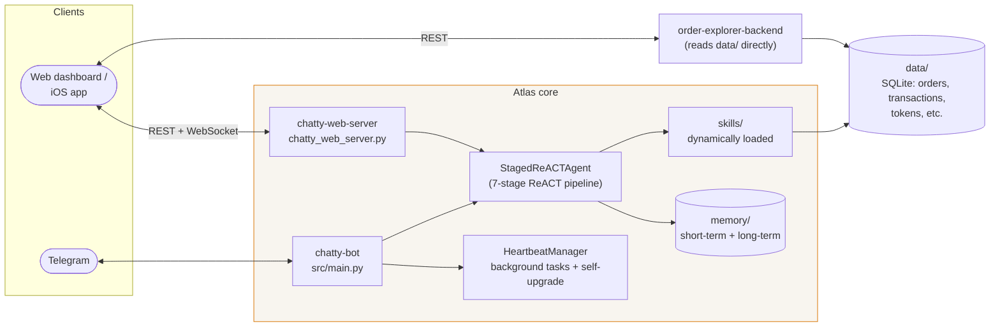

# Atlas

A personal AI assistant built on a **Staged ReACT (Reasoning and Acting) agent** with dynamically loaded **skills**. It runs as a Telegram bot (and/or web chat) with persistent per-user memory, background "heartbeat" tasks, and pluggable integrations (Gmail, Amazon/Walmart order tracking, budgeting via Plaid/RocketMoney, notes, reminders, weather, web search, and more) — plus a web dashboard for browsing all of it.

See [docs/ARCHITECTURE.md](docs/ARCHITECTURE.md) for how the agent pipeline and skill system work, and [docs/heartbeat.md](docs/heartbeat.md) for the background task scheduler.

## Screenshots

The web dashboard (`order_explorer_site/`) visualizes everything the skills collect — order history, budgeting, spending trends. Shown here with synthetic demo data, not real accounts.

| | |
|---|---|
|  |  |
| **Dashboard** — spend totals, trend line, top products/categories | **Orders** — every order across all connected sources, one timeline |
|  |  |
| **Budget** — month-to-date pace vs. projection | **Categories** — spending distribution across categories |

## Architecture at a glance



Full breakdown: [docs/ARCHITECTURE.md](docs/ARCHITECTURE.md).

## Features

- **Staged ReACT agent** — decompose → memory → plan → execute → synthesize → reflect → memorize (see [docs/ARCHITECTURE.md](docs/ARCHITECTURE.md))
- **Dual memory** — short-term daily logs consolidated into long-term categorized knowledge (see [docs/MEMORY_SYSTEM.md](docs/MEMORY_SYSTEM.md))
- **Dynamically loaded skills** — Gmail, Amazon/Walmart orders, Plaid/RocketMoney budgeting, LinkedIn/WhatsApp messaging, notes, reminders, weather, web search, speaker identification, and more — each a self-contained folder under `skills/`
- **Autonomous heartbeat** — periodic background tasks: memory consolidation, budget alerts, world/stock/GitHub watch, daily briefings, and a safety-gated **self-upgrade** pipeline where the bot proposes and implements small improvements to its own codebase (see [docs/heartbeat.md](docs/heartbeat.md))
- **Web dashboard** — order history, budgeting, categories/vendors, notes, transcriptions, memory browser, and more (`order_explorer_site/`)
- **iOS-companion API** — REST + WebSocket contract for a native client, including background audio ingestion (see [docs/IOS_APP_API.md](docs/IOS_APP_API.md))
- **Docker Compose deployment** — the whole stack behind one reverse proxy, no manual pm2/nginx/system-package setup (see below)

## Setup

1. **Install dependencies**
   ```bash
   python -m venv venv
   source venv/bin/activate
   pip install -r requirements.txt
   pip install -r requirements-face.txt  # optional: facial_recognition skill (needs dlib, slow build)
   ```

2. **Configure environment**
   ```bash
   cp .env.example .env
   # edit .env with your own API keys / tokens
   ```
   See `.env.example` for the full list of supported variables (OpenAI, Telegram, Gmail, Plaid, Google search, etc). Only the skills you actually use need their variables filled in.

3. **Per-skill credentials**
   Some skills need additional local credential files that are intentionally excluded from version control (see `.gitignore`):
   - `skills/gmail/credentials.json` — Google Cloud OAuth client, see `skills/gmail/gmail.md`
   - `data/` — local databases, OAuth tokens, and any personal data the skills generate at runtime live here and are never committed

4. **Run**
   ```bash
   ./start.sh
   ```

## Docker deployment

For a self-contained deployment (bot + web dashboard + order-explorer API/UI
behind one reverse proxy, no manual pm2/nginx/system-package setup), use
Docker Compose instead:

```bash
cp .env.example .env
# edit .env with your own API keys / tokens
docker compose up -d --build
open http://localhost/
```

This brings up six containers: `chatty-bot`, `chatty-web-server`,
`order-explorer-backend`, `order-explorer-frontend`, an `nginx` reverse proxy
(fronting all three web services on port 80), and a small `restarter`
sidecar (see below). Two more are opt-in via
[Compose profiles](https://docs.docker.com/compose/profiles/):

```bash
docker compose --profile searxng up -d   # self-hosted web search
docker compose --profile whisperx up -d  # local speaker-diarizing STT (see docker/whisperx/ - scaffold, not finished)
```

A few things worth knowing about this setup:
- `chatty-bot`, `chatty-web-server`, and `order-explorer-backend` bind-mount
  the live repo (not a baked-in copy) — this is required for the
  self-upgrade feature (`docs/heartbeat.md`) to work: it merges commits onto
  `main` via a real git checkout and expects a container **restart**, not a
  rebuild, to pick up the change. If a self-upgrade run adds a new
  Python/npm *dependency* rather than just code, a restart isn't enough —
  you'll need `docker compose build` for that one case.
- Restarting affected services after a self-upgrade/feature-request merge is
  handled by the `restarter` sidecar rather than pm2 — see
  [SECURITY.md](SECURITY.md#docker-deployment-the-restarter-sidecar-and-the-docker-socket)
  for why it's a separate container instead of giving the bot container
  Docker-socket access directly.
- `face-recognition` (the `facial_recognition` skill's `dlib` dependency) is
  a slow from-source build; skip it with
  `docker compose build --build-arg INSTALL_FACE_RECOGNITION=false`.
- The `pi` coding-agent CLI (used by self-upgrade/feature requests) has no
  public install package, so it's not baked into the image — mount your own
  binary at `./docker/pi-bin/pi` and its config at `./docker/pi-config/` (see
  `docker-compose.yml`) if you have access to it. `opencode` (the other
  coding agent these features can use) *is* installed automatically.

## Project layout

```
chatty/
├── src/              # Lean framework: agent loop, config, skill loader, managers
├── skills/           # Skill implementations (tools.py + a .md description per skill)
├── docs/             # Architecture and subsystem docs (docs/images/ for screenshots)
├── scripts/          # One-off maintenance/import scripts
├── tests/            # Test suite
├── docker/           # Dockerfiles/configs for the reverse proxy, restarter sidecar, frontend, searxng, whisperx
└── order_explorer_site/  # Web dashboard: FastAPI backend + React frontend
```

## Adding a new skill

See the "Creating a New Skill" section in [docs/ARCHITECTURE.md](docs/ARCHITECTURE.md).

## License

MIT — see [LICENSE](LICENSE).
