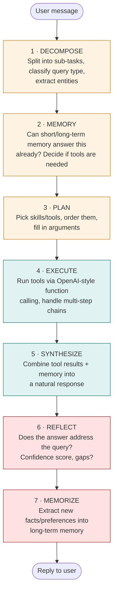
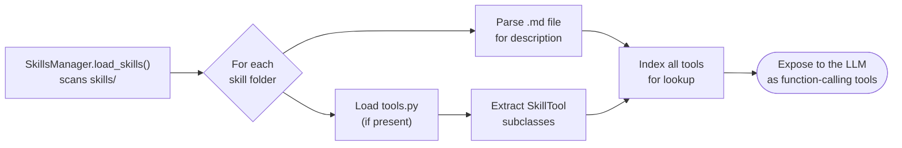

# Chatty Bot Architecture

## Overview

This project uses a **Staged ReACT (Reasoning and Acting) Agent** architecture with **dynamically loaded skills**. The `src/` directory contains only the lean framework code, while the bulk of tool implementations live in the `skills/` directory.

## Directory Structure

```
chatty/
├── src/                          # LEAN Framework Code
│   ├── agents/
│   │   └── staged_react_agent.py # Main ReACT agent with 7 stages
│   ├── core/
│   │   ├── skill_tool.py         # Base class for skill tools
│   │   ├── skills_manager.py     # Dynamic skill/tool loader
│   │   ├── memory.py             # Memory management
│   │   └── config.py             # Configuration
│   ├── tools/
│   │   ├── memory_tools.py       # Core memory tools (always loaded)
│   │   └── skills_tools.py       # Skill management tools
│   └── managers/
│       ├── heartbeat_manager.py  # Background tasks (see docs/heartbeat.md)
│       ├── reminder_manager.py   # Reminders
│       └── self_upgrade_manager.py # Self-upgrade pipeline (see docs/heartbeat.md)
│
├── skills/                        # SKILL IMPLEMENTATIONS
│   ├── walmart_orders/
│   │   ├── walmart_orders.md     # Skill description
│   │   ├── tools.py              # SkillTool definitions
│   │   ├── query_orders.py       # Implementation logic
│   │   └── walmart_parser.py     # Parser/DB code
│   ├── amazon_orders/
│   ├── gmail/
│   ├── plaid/
│   ├── rocketmoney/
│   └── ...
│
└── memory/                        # User memories
    └── {user_id}/
```

> **Note:** `src/core/base_tool.py` and `src/core/tool_registry.py` are leftovers
> from an earlier, intermediate refactor and are no longer wired into the live
> bot — `staged_react_agent.py` uses `SkillsManager`/`SkillTool` exclusively.
> Ignore them; the pattern below is the one actually in use.

## Staged ReACT Agent

The `StagedReACTAgent` processes user queries through 7 explicit stages:



### Stage 1: DECOMPOSE
- Break down the user's query into sub-tasks
- Identify query type (question, action, conversation, greeting)
- Extract key entities

### Stage 2: MEMORY
- Check if memory can answer the query
- Load short-term memory (last 3 days)
- Load long-term memory (consolidated facts)
- Determine if tools are needed

### Stage 3: PLAN
- Determine which skills/tools are needed
- Create execution plan with order and arguments
- Map tools to their providing skills

### Stage 4: EXECUTE
- Run the planned tools via function calling
- Handle multi-step tool chains
- Collect results from all tool executions

### Stage 5: SYNTHESIZE
- Combine tool results with memory context
- Generate a natural, helpful response
- Present information clearly

### Stage 6: REFLECT
- Evaluate if the answer addresses the query
- Assign confidence score
- Identify missing information

### Stage 7: MEMORIZE
- Identify new facts to remember
- Store important information in long-term memory
- Update user preferences

## Creating a New Skill

### 1. Create Skill Folder
```bash
mkdir -p skills/my_new_skill
```

### 2. Create Skill Description (my_new_skill.md)
```markdown
# My New Skill

## Description
What the skill does

## Usage
How to use it

## Examples
- "Example query 1"
- "Example query 2"
```

### 3. Create Tools (tools.py)
```python
"""My New Skill tools for LLM function calling."""
import json
import sys
import importlib.util
from pathlib import Path

# Add project root to path
project_root = str(Path(__file__).parent.parent.parent)
if project_root not in sys.path:
    sys.path.insert(0, project_root)

from src.core.skill_tool import SkillTool

# Load implementation module from this folder
_impl_path = Path(__file__).parent / "my_implementation.py"
_spec = importlib.util.spec_from_file_location("my_impl", _impl_path)
_impl = importlib.util.module_from_spec(_spec)
_spec.loader.exec_module(_impl)


class MyTool(SkillTool):
    """Description of what this tool does."""
    
    name = "my_tool_name"  # Must be unique across all skills
    description = "Detailed description for the LLM"
    parameters = {
        "type": "object",
        "properties": {
            "param1": {
                "type": "string",
                "description": "Description of param1"
            }
        },
        "required": ["param1"]
    }
    
    async def execute(self, param1: str) -> str:
        result = await _impl.my_function(param1)
        return json.dumps(result, indent=2)
```

### 4. Create Implementation (my_implementation.py)
```python
"""Implementation logic for My New Skill."""

async def my_function(param1: str):
    # Your implementation here
    return {"success": True, "data": "..."}
```

## Tool Loading

Skills and their tools are loaded dynamically when the application starts:



1. `SkillsManager.load_skills()` scans the `skills/` directory
2. For each skill folder:
   - Parses the `.md` file for description
   - Loads `tools.py` if it exists
   - Extracts all `SkillTool` subclasses
3. All tools are indexed for quick lookup
4. Tools are provided to the LLM via function calling

## Memory Tools (Core)

These tools are always available - hardcoded directly into `staged_react_agent.py`
(tool definitions in `_get_memory_tools_definitions()`, implementation in
`src/core/memory_tools.py`'s `MemoryTools` class) rather than loaded from `skills/`,
since every user needs them regardless of which skills are active:

- `search_memory_grep` - Search memory for patterns
- `search_recent_mentions` - Find recent topic mentions
- `read_memory_file` - Read complete memory files
- `list_memory_files` - List available memory files
- `get_memory_summary` - Get memory overview
- `save_important_fact` - Store facts to long-term memory

## Best Practices

1. **Keep src/ lean** - Only framework code goes in src/
2. **Tools in skills/** - All tool implementations belong in skill folders
3. **Explicit imports** - Use `importlib.util` to avoid import conflicts
4. **Descriptive tool names** - Use verb_noun format (e.g., `get_bank_balance`)
5. **Good descriptions** - Help the LLM understand when to use each tool
6. **JSON responses** - Tools should return JSON strings

## Running the Bot

```bash
# Activate virtual environment
source venv/bin/activate

# Start the bot
./start.sh
```

Or via Docker Compose — see the [root README](../README.md#docker-deployment).

## Configuration

Environment variables (in `.env`, copied from `.env.example`):
- `OPENAI_API_KEY` / `ANTHROPIC_API_KEY` - LLM provider credentials (see `CHAT_PROVIDER`)
- `TELEGRAM_BOT_TOKEN` - Telegram bot token
- `PLAID_CLIENT_ID` / `PLAID_SECRET` - Plaid API credentials

See [`.env.example`](../.env.example) for the complete, annotated list covering every skill and subsystem.
