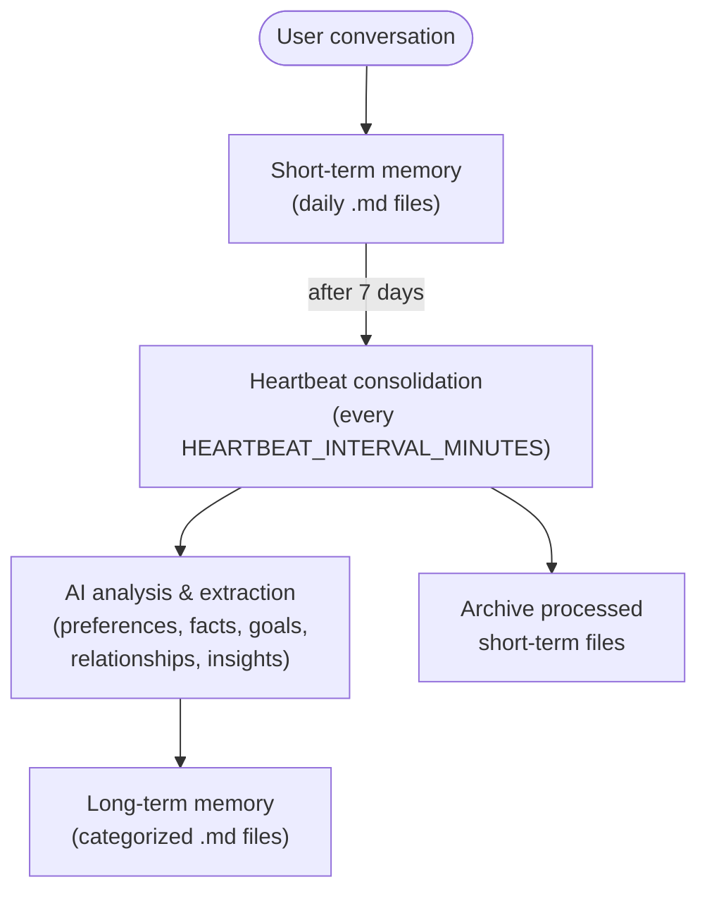

# Long-Term and Short-Term Memory System

## Overview

The bot now has a dual memory system that separates short-term conversation logs from long-term consolidated knowledge.

## Memory Types

### Short-Term Memory
- **Location**: `memory/{user_id}/short_term/`
- **Format**: Daily markdown files (e.g., `2026-01-30.md`)
- **Content**: Raw conversation logs with timestamps
- **Lifecycle**: Active conversations and recent history (last 7 days used in agent context)
- **Purpose**: Immediate conversational context and recent interactions

### Long-Term Memory
- **Location**: `memory/{user_id}/long_term/facts.json`
- **Format**: A single JSON list of individually-addressable facts, each with
  a stable UUID `id`, `category`, `content`, `created_at`/`updated_at`, and
  an optional `embedding` (see "Semantic search" below). Replaces the older
  markdown-file-per-category format, which had no way to edit or delete a
  single fact - see `src/core/long_term_facts.py`'s `LongTermFactsStore`.
- **Migration**: on first read, any pre-existing `{category}.md` files are
  parsed into fact records and renamed to `{category}.md.bak` (kept as a
  backup, inert to any future code). One-time and automatic - no action
  needed.
- **Content**: Consolidated insights extracted from old short-term memories
- **Lifecycle**: Permanent knowledge base, continuously updated
- **Purpose**: Persistent understanding of user preferences, facts, goals, and relationships

## Memory Flow



## Consolidation Process

### When It Happens
- Automatically during heartbeat cycles (every 15 minutes by default)
- Processes short-term memories older than 7 days

### How It Works
1. **Collection**: Gathers all short-term memory files older than 7 days
2. **Analysis**: AI agent analyzes conversations for important information
3. **Categorization**: Extracts and categorizes insights into:
   - Personal Preferences (likes, dislikes, habits)
   - Important Facts (name, location, job, family)
   - Goals and Projects (aspirations, ongoing work)
   - Relationships (important people)
   - Recurring Topics (frequent discussion themes)
   - Key Insights (important decisions, realizations)
4. **Storage**: Adds each extracted insight as a new fact record in that category
5. **Archiving**: Moves processed short-term files to `short_term/archived/`

### Deduplication

Periodically (also during heartbeat cycles), `MemoryManager.dedupe_facts()`
compares facts within each category pairwise (`difflib.SequenceMatcher`) and
removes the older of any near-duplicate pair. This replaced an older
`cleanup_long_term_memories()` that asked an LLM to rewrite a whole category
file to approximately dedupe it - now that facts are individually
addressable, dedup is exact instead of a rewrite gamble, and needs no LLM call.

### Forgetting a fact

Users can remove a specific long-term memory fact via:
- The `/forget <text>` Telegram command (searches by content; deletes
  automatically if there's exactly one match, otherwise offers buttons to
  pick which one)
- The agent tools `forget_fact`/`delete_fact_by_id` (`src/core/memory_tools.py`),
  which the LLM can call directly when a user asks to be forgotten mid-conversation

### Semantic search

Facts can optionally carry an embedding (OpenAI `text-embedding-3-small` by
default, generated at write time - see `src/core/embeddings.py`), enabling
the `semantic_search_memory` agent tool to rank facts by conceptual
relevance to a query instead of requiring an exact keyword match. This is
additive to (not a replacement for) `search_memory_grep`, which remains the
zero-dependency fallback and the only way to search short-term (daily log)
memory, since daily logs are not embedded.

### Manual Trigger
You can manually trigger memory consolidation using:
```
/heartbeat
```

## Agent Memory Usage

When the agent processes a message, it loads:
1. **Long-Term Memory** (50% of memory token budget)
   - All consolidated knowledge about the user
   - Persistent facts, preferences, and insights
   
2. **Short-Term Memory** (50% of memory token budget)
   - Last 3 days of conversations
   - Recent context and ongoing discussions

This dual approach ensures the agent has both:
- Deep understanding from past interactions (long-term)
- Immediate context from recent conversations (short-term)

## Directory Structure

```
memory/
└── {user_id}/
    ├── short_term/
    │   ├── 2026-01-30.md
    │   ├── 2026-01-29.md
    │   ├── 2026-01-28.md
    │   └── archived/
    │       ├── 2026-01-20.md
    │       └── 2026-01-19.md
    └── long_term/
        ├── facts.json          # all long-term facts (see LongTermFactsStore)
        └── *.md.bak            # legacy per-category files, kept as backups
                                 # after one-time migration to facts.json
```

## Benefits

1. **Better Context Management**: Recent details in short-term, important facts in long-term
2. **Improved Performance**: Focuses on relevant information rather than all history
3. **Knowledge Persistence**: Important information isn't lost in old conversation logs
4. **Scalability**: System remains efficient as conversation history grows
5. **Intelligence**: AI actively learns and remembers what matters most

## Commands

- `/memory` - View memory statistics for both short-term and long-term
- `/forget <text>` - Delete a long-term memory fact by content search
- `/heartbeat` - Manually trigger heartbeat (includes memory consolidation and dedup)

## Configuration

In `.env`:
```
HEARTBEAT_INTERVAL_MINUTES=15  # How often to run consolidation
```

## Technical Implementation

### Key Files
- `src/core/memory.py`: MemoryManager class with short/long-term support
- `src/core/long_term_facts.py`: `LongTermFactsStore` - the JSON+UUID fact
  store itself, plus the legacy-markdown migration and semantic search
- `src/core/embeddings.py`: Generates fact embeddings for semantic search
- `src/managers/heartbeat_manager.py`: Orchestrates consolidation and dedup during heartbeat
- `src/agents/staged_react_agent.py`: Uses both memory types in agent context (see docs/ARCHITECTURE.md)
- `docs/heartbeat.md`: Defines autonomous consolidation task

### Key Methods
- `MemoryManager.consolidate_memories()`: Main consolidation logic
- `MemoryManager.add_long_term_memory()`: Add a new long-term fact
- `MemoryManager.get_long_term_memory()`: Retrieve all long-term knowledge
- `MemoryManager.dedupe_facts()`: Remove near-duplicate facts within each category
- `MemoryManager.archive_short_term_memory()`: Archive processed files
- `LongTermFactsStore.add_fact()` / `delete_fact()` / `search_facts()` / `semantic_search()`: Per-fact CRUD and search
