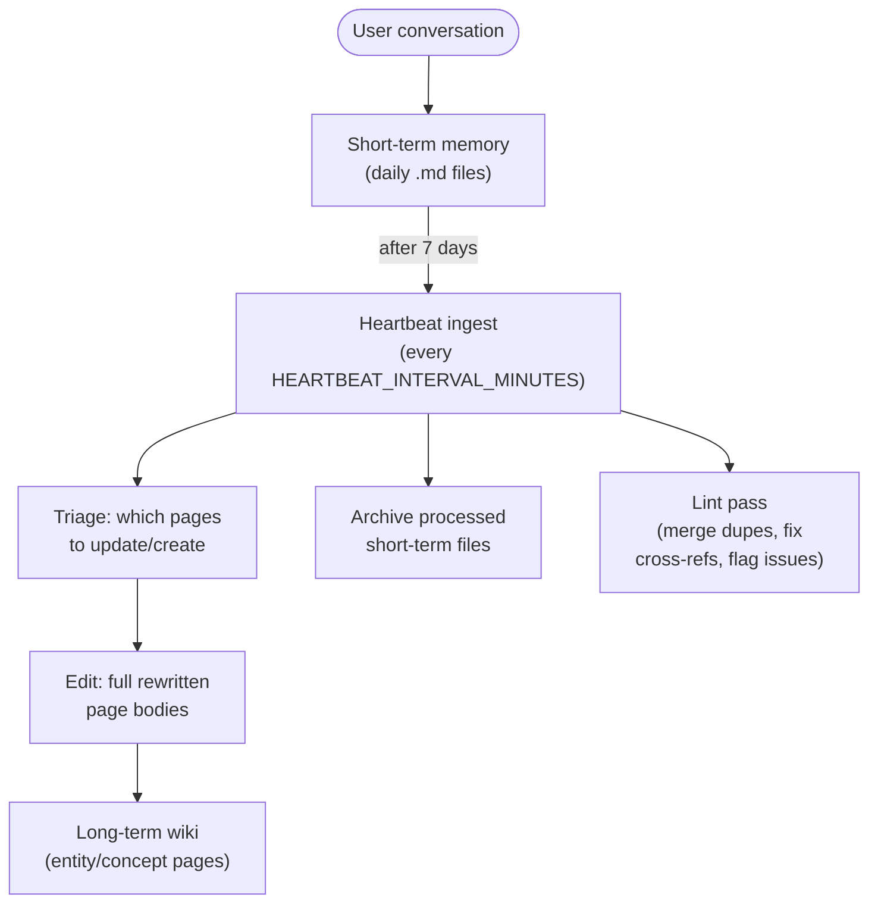

# Long-Term and Short-Term Memory System

## Overview

The bot has a dual memory system that separates short-term conversation logs from a long-term memory **wiki** - modeled on Andrej Karpathy's LLM-wiki pattern (https://gist.github.com/karpathy/442a6bf555914893e9891c11519de94f): LLM-owned markdown pages that get edited over time (not just appended to), organized around a content-oriented index and an append-only operations log.

## Memory Types

### Short-Term Memory
- **Location**: `memory/{user_id}/short_term/`
- **Format**: Daily markdown files (e.g., `2026-01-30.md`)
- **Content**: Raw conversation logs with timestamps
- **Lifecycle**: Active conversations and recent history (last 7 days used in agent context)
- **Purpose**: Immediate conversational context and recent interactions

### Long-Term Memory (the wiki)
- **Location**: `memory/{user_id}/long_term/wiki/`
- **Format**: One markdown file per page, split into `pages/entities/` (people, organizations, places, products) and `pages/concepts/` (themes, preferences, goals, recurring topics), each with a small YAML-like frontmatter block (`title`, `type`, `slug`, `summary`, `tags`, `created`, `updated`, `source_ids`) followed by a bulleted body. See `src/core/wiki_store.py`'s `WikiStore`.
- **`index.md`**: a content-oriented catalog - every page listed with a link and its one-line `summary`, generated/upserted automatically and never hand-edited outside `WikiStore`.
- **`log.md`**: an append-only, greppable timeline of every wiki operation (`## [timestamp] op | message` lines - `migrate`, `remember`, `ingest`, `lint`, `forget`).
- **Migration**: on first read, a pre-existing `facts.json` (the old flat JSON fact store) is migrated into one concept page per category and renamed to `facts.json.bak` (kept as a backup, never deleted). One-time, automatic, idempotent - no action needed. This is deliberately a "dump, don't curate" migration; the heartbeat's ingest and lint passes organically refile the content into proper entity/concept pages over subsequent cycles.
- **Content**: Consolidated, continuously-edited knowledge extracted from short-term memories
- **Lifecycle**: Permanent knowledge base, continuously updated (pages get rewritten as new information arrives, not just appended to)
- **Purpose**: Persistent understanding of user preferences, facts, goals, relationships, and the people/things in the user's life

## Memory Flow



## Ingest Process (replaces the old flat-fact consolidation)

### When It Happens
- Automatically during heartbeat cycles (every 15 minutes by default)
- Processes short-term memories older than 7 days

### How It Works (`MemoryManager._ingest_content()`, two LLM calls)
1. **Triage**: given the wiki's `index.md` and the new content, the LLM decides which *existing* pages (if any) to update and which *new* pages (if any) to create - output as JSON (`update_pages`, `create_pages`).
2. **Edit**: given the new content plus the *current full body* of only the pages triage selected (not the whole wiki - keeps token cost roughly constant regardless of total wiki size), the LLM produces a full rewritten body per page. This is the wiki's "edit, don't just append" behavior - a page's content is periodically refined and reorganized, not just grown.
3. **Apply**: each page gets written via `WikiStore.write_page()`, guarded by a cheap "did we lose stuff" check (reject and keep the old page if the new body is drastically shorter and missing most of the old body's distinct lines - logged for manual review rather than silently applied), `index.md` gets rebuilt once for the whole batch, and one `ingest` line is appended to `log.md` per touched page.
4. **Archiving**: Moves processed short-term files to `short_term/archived/` once the ingest call succeeds (even if nothing turned out to be memory-worthy).

The same two-call ingest also powers `MemoryManager.consolidate_text()`, used to mine mined transcriptions (e.g. iOS voice memos) - it just sources content from raw text instead of short-term files, and uses `get_llm_provider()` directly since there's no live per-user agent instance in that path.

### Lint pass (replaces the old flat-fact `dedupe_facts()`)

`MemoryManager.lint_wiki()` runs alongside ingest during heartbeat cycles:

- **Auto-fixed** (safe, mechanical): near-duplicate pages (title+summary similarity >= 0.95, stricter than the old fact-level 0.85 since merging whole pages is riskier) get merged - the older page's body is folded into the newer one under a "Merged from ..." heading, then deleted. Bare literal mentions of another page's title get rewritten into markdown cross-reference links.
- **Flag-only, never auto-applied**: orphan pages (no inbound links from other pages), contradictions between pages (one LLM call, given the index and recently-updated page bodies), and coverage gaps (a theme mentioned repeatedly with no dedicated page). All three are logged to `log.md` for review - auto-resolving "which claim is correct" or "is this really a new topic" risks silently discarding correct information, which is worse than a flagged line waiting for review.

### Forgetting a fact

Users can remove a specific long-term memory fact via:
- The `/forget <text>` Telegram command (searches every page's body for matching lines; deletes automatically if there's exactly one match, otherwise offers buttons to pick which one - the candidate list is cached in-process per user since a specific line's exact text doesn't fit Telegram's `callback_data` byte limit)
- The agent tool `forget` (`src/core/memory_router.py`), which the LLM can call directly when a user asks to be forgotten mid-conversation - on multiple matches, it's told to call `forget` again with more specific wording rather than picking an id (the 3-tool LLM surface has no id-based delete)

A fact is addressed by its **verbatim bullet-line text** within a page (`type/slug`), not a numeric/UUID id - robust to the page having been lightly re-edited between "list candidates" and "delete the chosen one" (deletion just reports "not found, it may have changed" instead of risking the wrong line).

### Retrieval: index-first, no embeddings

`MemoryRouter.recall()` (`src/core/memory_router.py`) scores pages by keyword hits in `title`/`summary`/`tags` against `index.md` - no embeddings, no `OPENAI_API_KEY` dependency for long-term memory at all. If keyword scoring finds nothing: on a small wiki (<=15 pages), fall back to a full-text substring search over page bodies; on a larger wiki, one LLM call over the index picks relevant pages. This mirrors Karpathy's own pattern - index-first lookup works well at moderate scale without vector-search infrastructure.

### Manual Trigger
You can manually trigger memory ingest using:
```
/heartbeat
```

## Agent Memory Usage

When the agent processes a message, it loads:
1. **Long-Term Memory** (50% of memory token budget)
   - All wiki pages' content, budgeted per page
   - Persistent facts, preferences, entities, and insights
   
2. **Short-Term Memory** (50% of memory token budget)
   - Last 3 days of conversations
   - Recent context and ongoing discussions

Both `StagedReACTAgent` (Telegram) and `WebChatAgent` (web dashboard) can also actively call `recall`/`remember`/`forget` mid-conversation, not just passively receive this as context.

## Directory Structure

```
memory/
└── {user_id}/
    ├── short_term/
    │   ├── 2026-01-30.md
    │   ├── 2026-01-29.md
    │   ├── 2026-01-28.md
    │   └── archived/
    │       ├── 2026-01-20.md
    │       └── 2026-01-19.md
    └── long_term/
        ├── facts.json.bak      # legacy flat fact store, kept as a backup
        │                        # after one-time migration to the wiki
        └── wiki/
            ├── index.md         # catalog of every page + one-line summary
            ├── log.md           # append-only operations timeline
            └── pages/
                ├── entities/
                │   └── sarah.md
                └── concepts/
                    └── budgeting.md
```

## Benefits

1. **Better Context Management**: Recent details in short-term, curated/edited knowledge in the long-term wiki
2. **Improved Performance**: Focuses on relevant information rather than all history
3. **Knowledge Persistence**: Important information isn't lost in old conversation logs
4. **Compounding Knowledge**: Pages get refined/reorganized over time instead of just growing - the wiki compiles knowledge rather than re-deriving it on every query
5. **Human-readable**: Every page is plain markdown - browsable/editable directly, not opaque JSON or embeddings

## Commands

- `/memory` - View memory statistics for both short-term and long-term
- `/forget <text>` - Delete a long-term memory fact by content search
- `/heartbeat` - Manually trigger heartbeat (includes wiki ingest and lint)

## Configuration

In `.env`:
```
HEARTBEAT_INTERVAL_MINUTES=15  # How often to run ingest/lint
```

## Technical Implementation

### Key Files
- `src/core/memory.py`: `MemoryManager` class with short-term support plus the wiki ingest/lint orchestration
- `src/core/wiki_store.py`: `WikiStore` - the markdown wiki itself: page CRUD, `index.md`/`log.md` maintenance, keyword/full-text search, migration from the legacy `facts.json`, and lint primitives (duplicate detection/merge, cross-reference fixing, orphan detection)
- `src/core/memory_router.py`: `MemoryRouter` - the `recall`/`remember`/`forget` LLM tool surface
- `src/managers/heartbeat_manager.py`: Orchestrates ingest and lint during heartbeat
- `src/agents/staged_react_agent.py` / `src/agents/web_chat_agent.py`: Use both memory types in agent context (see docs/ARCHITECTURE.md)
- `docs/heartbeat.md`: Defines autonomous consolidation task

### Key Methods
- `MemoryManager.consolidate_memories()` / `consolidate_text()`: Two-call wiki ingest (triage, then edit)
- `MemoryManager.add_long_term_memory()`: Synchronous, LLM-free bullet-append to a wiki page (used by `remember()`)
- `MemoryManager.get_long_term_memory()`: Retrieve all wiki page content, budgeted
- `MemoryManager.lint_wiki()`: Merge duplicates, fix cross-references, flag orphans/contradictions/coverage gaps
- `WikiStore.write_page()` / `append_section()` / `delete_line()` / `search_index()` / `search_pages_fulltext()` / `find_matches()`: Page CRUD and search
